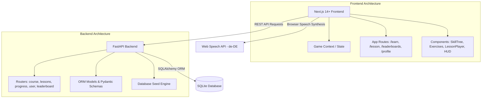
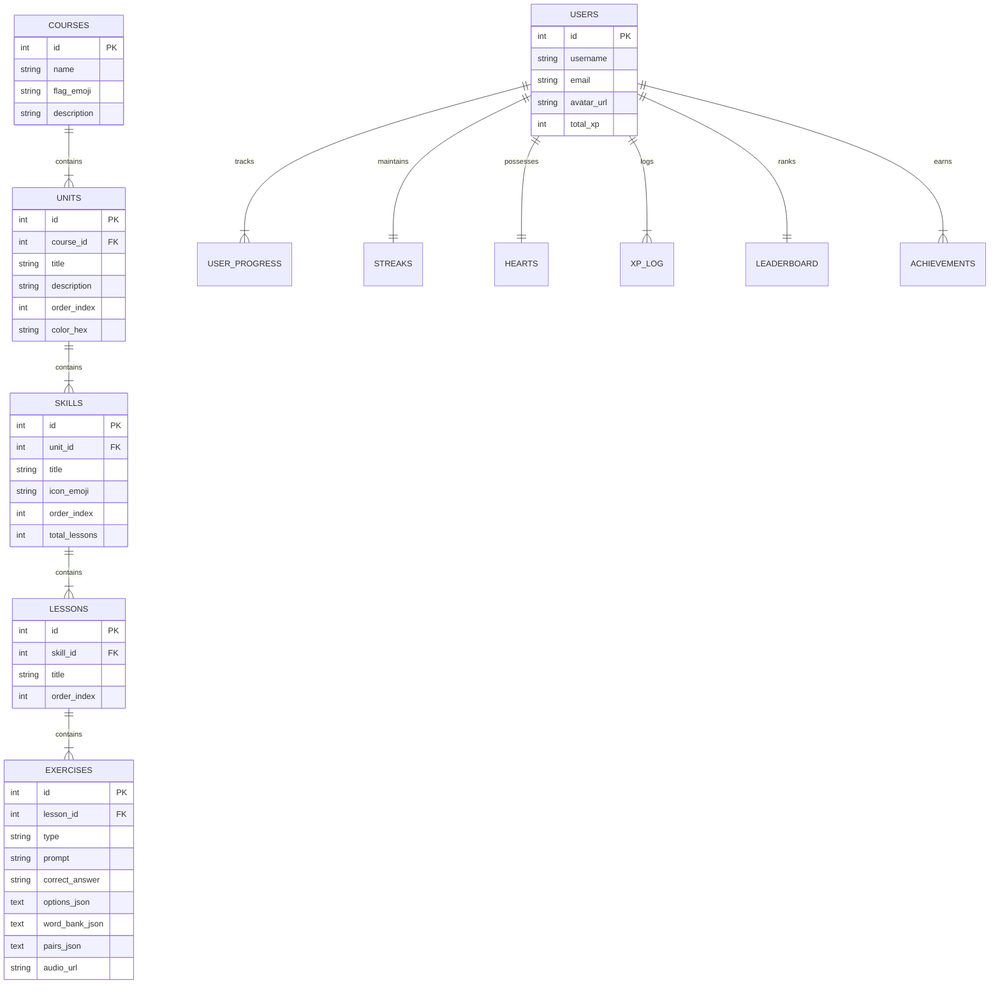

# 🦉 Duolingo Web App Clone (German 🇩🇪)

A full-stack, portfolio-quality clone of the Duolingo web application built with **Next.js 14+**, **Python FastAPI**, and **SQLite**. Replicates Duolingo's dark gamified design, interactive lesson player loop with 5 exercise types, German pronunciation via Web Speech API TTS, daily streaks, hearts lives system, XP leaderboards, and learner profiles.

---

## 🚀 Tech Stack

- **Frontend:** Next.js (App Router, TypeScript, Tailwind CSS v4, Framer Motion, react-hot-toast)
- **Backend:** Python FastAPI (SQLAlchemy ORM, Pydantic v2, Uvicorn)
- **Database:** SQLite (with seeded German course content and multi-user leaderboard)
- **Audio / TTS:** Web Speech API (`SpeechSynthesis` with `lang: 'de-DE'`)

---

## 📸 Core Features

1. **Learning Path / Skill Tree:**
   - Visual winding zig-zag learning path with Unit banners and Guidebooks.
   - Skill nodes with interactive states: Locked 🔒, Available ▶️, and Completed ✅.
   - Crown level counters and dynamic progress rings per skill.
   - Top HUD displaying streak 🔥, XP ⚡, gems 💎, hearts ❤️, and user avatar.

2. **Interactive Lesson Player (Core Loop):**
   - 5 distinct exercise types:
     - 🔘 **Multiple Choice:** 4-option selection with German audio.
     - 🧩 **Word Bank / Tap-the-Words:** Interactive translation word chip assembler.
     - 🔀 **Match Pairs:** Interactive column matching with real-time feedback.
     - ✍️ **Fill in the Blank:** Sentence completion inline input.
     - ⌨️ **Type the Answer:** Free-form German text translation.
   - Signature Duolingo bottom feedback bar (Green for correct 🎉, Red for wrong 💔 with correct answer display).
   - Real-time animated progress bar across exercises.
   - Hearts deduction on incorrect answers with an "Out of Hearts" modal.
   - Celebration modal on lesson completion with XP award, accuracy %, streak counter, and confetti animation.

3. **Gamification & Progress Tracking:**
   - **Daily Streaks:** Tracks daily activity dates, increments streaks, and handles break logic.
   - **Hearts System:** Starts with 5 hearts, deducts 1 per mistake, with in-app gem refill capabilities.
   - **Weekly Leaderboard:** Live ranking of 10 users across leagues (Bronze, Silver, Gold).
   - **Achievements & Badges:** Unlockable badges for milestones (First Step, 7-Day Streak, XP Centurion).
   - **Learner Profile:** Comprehensive statistics page displaying user progress, streaks, total XP, and unlocked badges.

---

## 🏛️ Architecture Overview



---

## 🗄️ Database Schema



### Table Descriptions

- `courses`: Language course metadata (German 🇩🇪).
- `units`: Thematic units with unique hex color themes.
- `skills`: Skill path nodes with total lesson counts & emoji icons.
- `lessons`: Ordered lesson sequences within a skill.
- `exercises`: Individual questions (multiple choice, word bank, match pairs, fill blank, type answer).
- `users`: Learner profiles and account details.
- `user_progress`: Per-skill completion, crowns (0–5), and earned XP.
- `streaks`: Daily streak counters and last activity date.
- `hearts`: Lives counter (max 5) and refill timestamps.
- `xp_log`: Audit trail for XP earned per lesson.
- `leaderboard`: Weekly XP league standings and ranks.
- `achievements`: Badges earned by learners.

---

## 🔌 API Reference Overview

| Router | Method | Endpoint | Description |
|---|---|---|---|
| **Course** | `GET` | `/api/courses/` | List all available language courses |
| **Course** | `GET` | `/api/courses/{id}/units?user_id=1` | Get full unit & skill tree with user progress & lock states |
| **Lessons** | `GET` | `/api/lessons/{id}/exercises` | Fetch ordered exercises for a lesson |
| **Progress** | `POST` | `/api/progress/complete` | Complete lesson, award XP, update streak & achievements |
| **Progress** | `POST` | `/api/progress/wrong` | Deduct a heart on wrong answer |
| **Progress** | `POST` | `/api/progress/refill-hearts` | Refill hearts to max (5) |
| **User** | `GET` | `/api/user/{id}` | Get full user profile, streak & hearts |
| **User** | `GET` | `/api/user/{id}/achievements` | Get user unlocked badges |
| **Leaderboard** | `GET` | `/api/leaderboard/?user_id=1` | Get weekly XP leaderboard rankings |

---

## 🛠️ Local Development Setup

### Prerequisites

- Node.js (v18+)
- Python (v3.10+)

### 1. Backend Setup

```bash
cd backend

# Create virtual environment
python -m venv .venv
source .venv/bin/activate  # On Windows: .venv\Scripts\activate

# Install dependencies
pip install -r requirements.txt

# Seed the database (Creates German course, 4 units, 12 skills, 36 lessons, 180 exercises, 10 users)
python seed.py

# Start FastAPI server
uvicorn app.main:app --reload --port 8000
```
- API Swagger Documentation: `http://localhost:8000/docs`

### 2. Frontend Setup

```bash
cd frontend

# Install dependencies
npm install

# Environment setup (.env.local is pre-configured)
# NEXT_PUBLIC_API_URL=http://localhost:8000

# Start Next.js development server
npm run dev
```
- Application Web Interface: `http://localhost:3000`

---

## ☁️ Deployment Instructions

### Backend (Render / Railway / Fly.io)

1. Connect repository to Render.
2. Select **Web Service** with runtime **Python**.
3. Build Command: `pip install -r requirements.txt && python seed.py`
4. Start Command: `uvicorn app.main:app --host 0.0.0.0 --port $PORT`
5. Set environment variable `DATABASE_URL=sqlite:///./duolingo.db`.

### Frontend (Vercel / Netlify)

1. Connect repository to Vercel.
2. Set Root Directory to `frontend`.
3. Set Environment Variable `NEXT_PUBLIC_API_URL=https://your-backend-api.onrender.com`.
4. Deploy!

---

## 💡 Key Design Decisions & Assumptions

- **Simplified Auth:** Default learner session (`user_id = 1`) to focus on gamification & core loop evaluation.
- **Seeded German Course:** 1 full course (German) seeded with 3 thematic units, 9 skills, 27 lessons, and 135 exercises.
- **Native Web Speech TTS:** Native German pronunciation powered by `window.speechSynthesis` with `de-DE` locale for zero-latency audio playback without external API keys.
