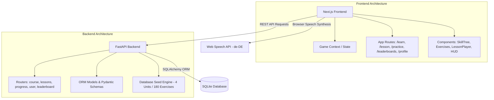
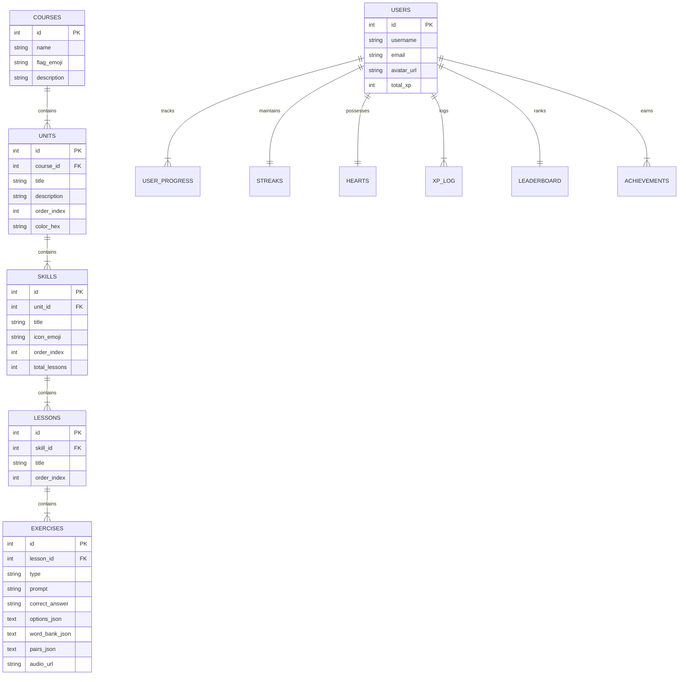

# 🦉 Duolingo Web App Clone (German 🇩🇪)

A full-stack, portfolio-quality clone of the Duolingo web application built with **Next.js 14+**, **Python FastAPI**, and **SQLite**. Replicates Duolingo's dark/light gamified UI, interactive lesson player loop with 5 exercise types, German pronunciation via Web Speech API TTS (with normal and slow speed controls), daily streaks, heart lives system (with 10-minute auto-regeneration), XP leaderboards across seeded users, timed practice mode, legendary challenges, achievements, and learner profiles.

---

## 🔗 Live Deployment & Links

- 🌐 **Live Frontend Application (Vercel):** [https://duolingo-clone-ten-navy.vercel.app](https://duolingo-clone-ten-navy.vercel.app)
- ⚡ **Live Backend API (Render):** [https://duolingo-clone-api-pww5.onrender.com](https://duolingo-clone-api-pww5.onrender.com)
- 💻 **GitHub Repository:** [https://github.com/Saksham0121/Duolingo_clone](https://github.com/Saksham0121/Duolingo_clone)

---

## 🚀 Tech Stack

- **Frontend:** Next.js (App Router, TypeScript, Vanilla CSS Tokens, Framer Motion, HTML5 Audio / Web Speech API)
- **Backend:** Python FastAPI (SQLAlchemy ORM, Pydantic v2, Uvicorn, python-dotenv)
- **Database:** SQLite (seeded with 4 Units, 12 Skills, 36 Lessons, 180 Exercises, 10 Users)
- **Audio / TTS:** Web Speech API (`SpeechSynthesis` with `lang: 'de-DE'` & Dual Speed Controls)

---

## 📸 Core Features & Highlights

1. **Learning Path & Sticky Unit Headers:**
   - Winding zig-zag learning path featuring Unit banners and Guidebooks.
   - Sticky unit header that pins cleanly to `top: 1rem` (desktop) and `top: 3.75rem` (mobile) while scrolling within a unit and transitions smoothly to the next unit.
   - Crown level counters and dynamic progress rings per skill.
   - Interactive skill states: Locked 🔒, Available ▶️, and Completed ✅.

2. **Interactive Lesson Player (Core Loop):**
   - **5 Exercise Types:**
     - 🔘 **Multiple Choice:** 4-option selection with German audio.
     - 🧩 **Word Bank / Tap-the-Words:** Interactive translation word chip assembler.
     - 🔀 **Match Pairs:** Interactive column matching with real-time feedback.
     - ✍️ **Fill in the Blank:** Inline sentence completion input.
     - ⌨️ **Type the Answer:** Free-form German text translation with keyboard shortcut helpers (`u` -> `ü`).
   - Signature Duolingo bottom feedback bar (Green for correct 🎉, Red for wrong 💔 with correct answer display).
   - Hearts deduction on incorrect answers with an "Out of Hearts" modal and **10-minute auto-regeneration** (+1 heart every 600s).
   - Celebration modal on lesson completion with XP award, accuracy %, streak counter, and confetti animation.

3. **🔊 German Audio TTS (Dual Speed Controls):**
   - Built-in German pronunciation (`de-DE` locale) powered by Web Speech API.
   - **🔊 Normal Speed (0.9x):** Standard native German pronunciation.
   - **🐢 Slow Speed (0.55x):** Slower, enunciated speed for language learners.

4. **⏱️ Timed Practice & 👑 Legendary Challenge Mode:**
   - **60-Second Timed Arena (`/practice`):** Rapid-fire practice mode with countdown timer, **🔥 Combo Multipliers (2x, 3x XP)**, and bonus XP summary popup (+50 XP).
   - **Legendary Challenge Mode:** Completed skills unlock a glowing purple/gold **START LEGENDARY CHALLENGE 👑 (+50 XP)** button with crown badges.

5. **☀️ Light Theme & 🌙 Dark Theme Switcher:**
   - Default Dark Theme matching Duolingo's sleek dark UI.
   - One-tap Theme Switcher item in the left sidebar (`Sidebar.tsx`) switching to pure white backgrounds (`#ffffff`, `#f7f9fa`), crisp borders (`#e5e7eb`), and dark gray typography (`#111827`).
   - Theme choice persisted in `localStorage`.

6. **🏆 Weekly Leaderboards & 🏅 Achievements:**
   - Live weekly XP rankings across 10 seeded users in the **Bronze League**.
   - Distinct **⬆️ PROMOTION ZONE (TOP 3 ADVANCE)** divider line and top 3 trophies (🥇, 🥈, 🥉).
   - Unlocked vs. locked achievement cards on `/profile` (*Wildfire* 🔥, *Sage* 🌟, *Scholar* 📖, *Legendary* 👑).

7. **📱 Mobile & Tablet Responsive Layout:**
   - Mobile bottom navigation bar (`MobileNav.tsx`) and compact top HUD (`TopHUD.tsx`).
   - Compact unit headers on phone screens to optimize vertical screen real estate.
   - Fixed non-scrolling sidebars on desktop (`Sidebar.tsx` & `RightPanel.tsx`).

8. **🧪 Interactive Test Controls:**
   - **`🧪 Test Streak Reset`** button on `/profile` calling `POST /api/user/1/simulate-missed-day` to test breaking and rebuilding daily streaks.

---

## 🏛️ Architecture Overview



---

## 🗄️ Database Schema



### Table Descriptions

- `courses`: Language course metadata (German 🇩🇪).
- `units`: Thematic units with unique hex color themes (Units 1–4).
- `skills`: Skill path nodes with total lesson counts & emoji icons (Skills 1–12).
- `lessons`: Ordered lesson sequences within a skill (Lessons 1–36).
- `exercises`: Individual questions (180 total exercises across 5 types).
- `users`: Learner profiles and 10 seeded leaderboard competitors.
- `user_progress`: Per-skill completion, crowns (0–5), and earned XP.
- `streaks`: Daily streak counters and last activity date.
- `hearts`: Lives counter (max 5) and 10-minute refill timestamp.
- `xp_log`: Audit trail for XP earned per lesson.
- `leaderboard`: Weekly XP league standings, ranks, and promotion zones.
- `achievements`: Badges earned by learners.

---

## 🔌 API Overview

| Router | Method | Endpoint | Description |
|---|---|---|---|
| **Course** | `GET` | `/api/courses/` | List all available language courses |
| **Course** | `GET` | `/api/courses/{id}/units?user_id=1` | Get full unit & skill tree with user progress & lock states |
| **Lessons** | `GET` | `/api/lessons/{id}/exercises` | Fetch ordered exercises for a lesson |
| **Progress** | `POST` | `/api/progress/complete` | Complete lesson, award XP, update streak & achievements |
| **Progress** | `POST` | `/api/progress/wrong` | Deduct a heart on wrong answer |
| **Progress** | `POST` | `/api/progress/refill-hearts` | Refill hearts to max (5) |
| **User** | `GET` | `/api/user/{id}` | Get full user profile, streak & hearts |
| **User** | `GET` | `/api/user/{id}/achievements` | Get user unlocked badges |
| **User** | `POST` | `/api/user/{id}/simulate-missed-day` | Reset streak to 0 (testing endpoint) |
| **Leaderboard** | `GET` | `/api/leaderboard/?user_id=1` | Get weekly XP leaderboard rankings |

---

## 🛠️ Local Setup Instructions

### Prerequisites

- **Node.js:** v18+
- **Python:** v3.10+

### 1. Backend Setup

```bash
cd backend

# Create virtual environment
python -m venv .venv
source .venv/bin/activate  # On Windows: .venv\Scripts\activate

# Install dependencies
pip install -r requirements.txt

# Seed the database (Creates German course, 4 units, 12 skills, 36 lessons, 180 exercises, 10 users)
python seed.py

# Start FastAPI server
uvicorn app.main:app --reload --port 8000
```
- API Swagger Documentation: `http://localhost:8000/docs`

### 2. Frontend Setup

```bash
cd frontend

# Install dependencies
npm install

# Environment setup (falls back to live Render backend or localhost)
# NEXT_PUBLIC_API_URL=https://duolingo-clone-api-pww5.onrender.com

# Start Next.js development server
npm run dev
```
- Application Web Interface: `http://localhost:3000`

---

## ☁️ Cloud Deployment Guide

### Backend (Render)

1. Connect repository to Render.
2. Select **Web Service** with runtime **Python 3**.
3. Build Command: `pip install -r requirements.txt && python seed.py`
4. Start Command: `uvicorn app.main:app --host 0.0.0.0 --port $PORT`
5. Set environment variables:
   - `DATABASE_URL=sqlite:///./duolingo.db`
   - `PYTHON_VERSION=3.11.9`

### Frontend (Vercel)

1. Connect repository to Vercel.
2. Set Root Directory to `frontend`.
3. Set Environment Variable: `NEXT_PUBLIC_API_URL=https://duolingo-clone-api-pww5.onrender.com`
4. Deploy!

---

## 💡 Key Design Decisions & Assumptions

- **Simplified Auth:** Default learner session (`user_id = 1`) to focus on gamification & core loop evaluation.
- **Seeded German Course Data:** 4 units, 12 skills, 36 lessons, 180 exercises, and 10 seeded users.
- **Native Web Speech TTS:** Native German pronunciation powered by `window.speechSynthesis` with `de-DE` locale and dual speed controls (0.9x normal, 0.55x slow).
